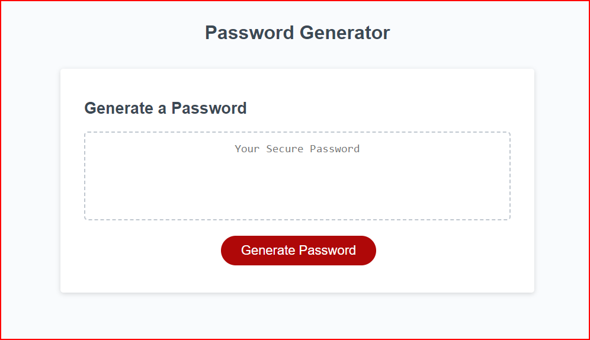

# Uncrackable
## Table of Contents

- [Description](#Description)
- [Project URL](#Project-URL)
- [Deployment](#Deployment)
- [Demo/Screenshots](#Demo/Screenshots)
- [Technologies](#Technologies)
- [License](#License)
- [Resources](#Resources)
- [Contact](#Contact)
- [Author](#Author)

## Project URL

<>

## Delpoyment

- []()

## Demo/Screenshots

  <table>
    <tr>
      <td>Uncrackable Page Example</td>
    </tr>
    <tr>
      <td></td>
    </tr>
  </table>

## Technologies

```
HTML, CSS, Javascript
```

## License

This project is not licensed

## Resources
- [codecadmey](codecadmey.com/)
- [youtube](https://youtube.com/)
- [w3schools](https://www.w3schools.com/)
-[javascript.info](https://javascript.info/structure)
-[GURU99](https://www.guru99.com/interactive-javascript-tutorials.html)
-[freecodecamp](https://www.freecodecamp.org/learn/javascript-algorithms-and-data-structures/)

## Contact

Email: sasasa@gmail.com

## Author

Author(s): Sachi Kaleikau-Takaoka
GitHub: <https://github.com/kaleikautakaoka>
